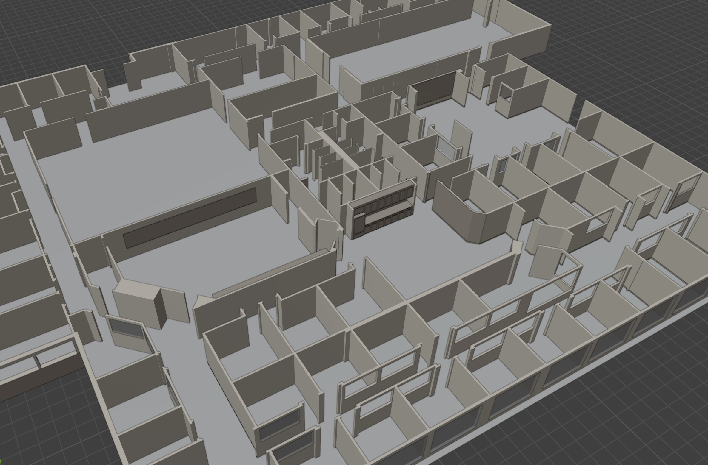

# Introduction

This is a gazebo world for testing the navigation stack of ROS2. It is based on the willow garage world, but with some modifications to make it more suitable for testing navigation algorithms.

<!-- 68 Willow Road, Menlo Park, California 94025, USA

<iframe
  width="600"
  height="450"
  frameborder="0"
  scrolling="no"
  src="https://www.openstreetmap.org/export/embed.html?bbox=-122.150%2C37.450%2C-122.145%2C37.455&layer=mapnik">
</iframe> -->
